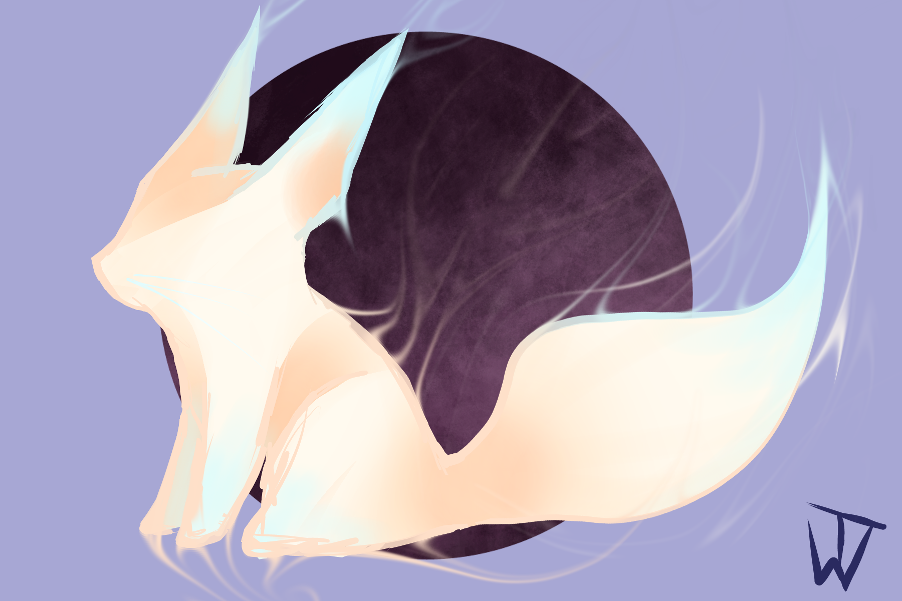

# Visual Novel

## Project Description

* Static Part 
   * The static part of our website will be a about the game  you will be able to play on there.There's going to be a description of the story and the Charcters.
* Interactive Part
  * The interactive part will be the game we are going to create. It will have a small story which can have different turns and endings based on the descisons the player makes.

## Goals
* creating a fun game 
* making the game have decent graphics

## Enviormental Analysis, Risks and Showstoppers
Audience Group
 * generally people of all ages who enjoy playing games

Potential Risks
 * not being able to finish our project till the deadline
 * lacking ideas for characters or the story

 Technologies
 * static part  : HTML,CSS
 * dynamic part : TypeScript

## Main Tasks
 * story and character ideas(till the new year)
 * creating a logo (end of January)
 * static part of the webiste (till end of the semester)
 * interactive part (till deadline)

## Team
 
* Emma Walchshofer
* Lisa Pichler
* Mia Marceta

